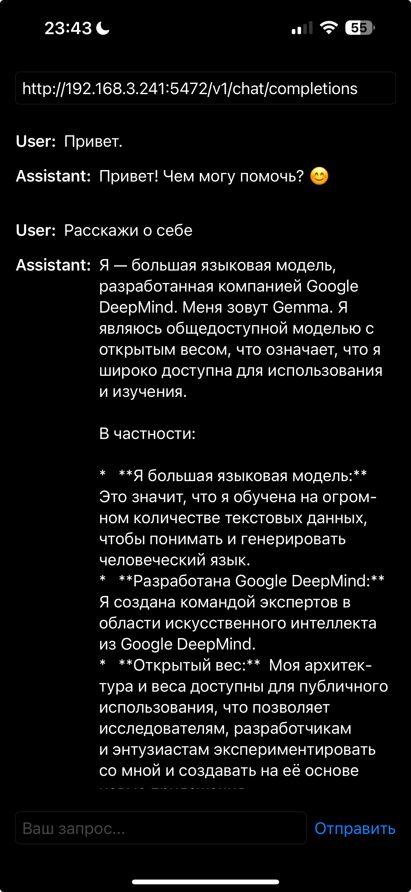
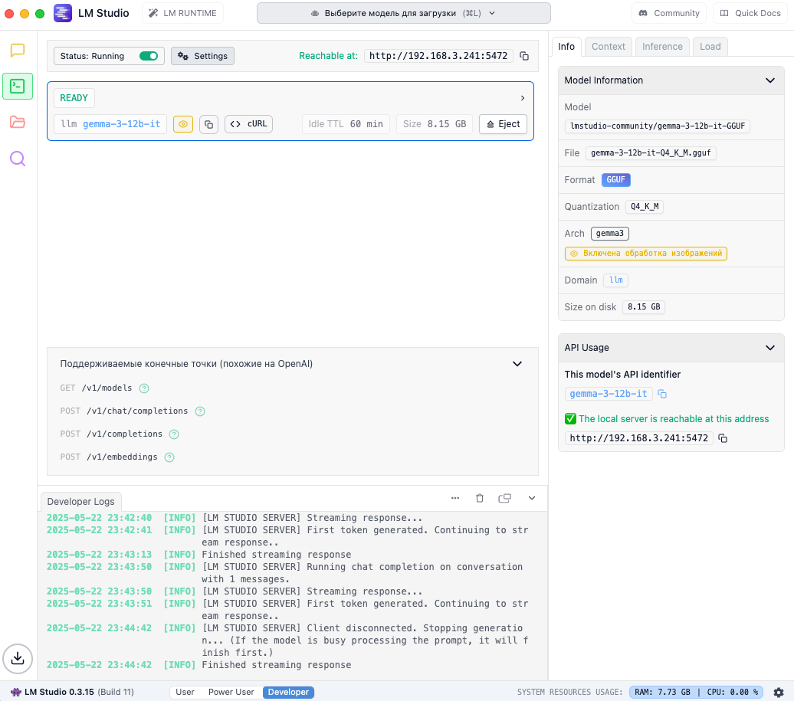

# 🧠 LocalMind

Локальное iOS-приложение для общения с LLM (локальной нейросетью) через домашний сервер.

---

## ✨ Возможности

- Подключение к локальному серверу LM Studio или Ollama
- Отправка запросов прямо с iPhone
- Ответы от нейросети без интернета
- Простое и понятное оформление

---

## 🖼️ Скриншоты

**Интерфейс приложения на iPhone:**  

**LM Studio (серверная часть):**  

---

## 🛠️ Технологии

- SwiftUI
- Combine
- URLSession
- LM Studio / Ollama API

---

## 🚧 Планы на будущее

- [ ] История чатов
- [ ] Переключение между моделями
- [ ] Поддержка светлой и тёмной темы
- [ ] Интеграция с Ollama (через сервер)
- [ ] Сохранение сессий и локальное хранилище

---

## 🚀 Запуск

1. Установите [LM Studio](https://lmstudio.ai) и загрузите модель (например, Gemma)
2. Убедитесь, что сервер доступен по локальному IP (например, `http://192.168.0.123:11434`)
3. Запустите проект в Xcode на устройстве или симуляторе
4. Введите адрес сервера в приложении и начните диалог с нейросетью

---
